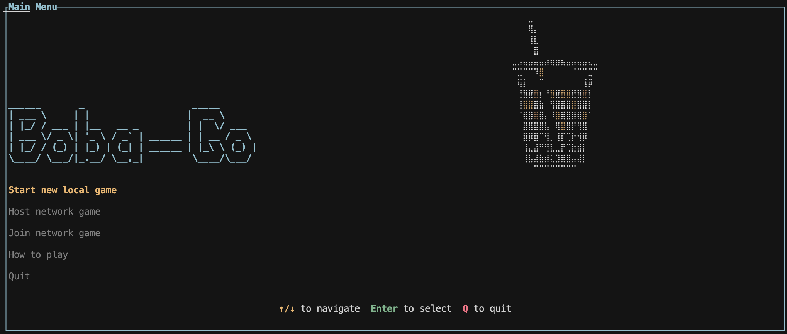

# boba-go
libp2p card game based on [sushi-go](https://www.amazon.com/Sushi-Go-Pick-Pass-Card/dp/B00J57VU44) with ratatui rendering. Thanks to [this repo](https://github.com/kaichaosun/rust-libp2p-examples) for help with libp2p networking and [this ASCII art generator](https://patorjk.com/software/taag/) for title ascii art. 

## Run
```bash
cargo run --bin boba_tui
```

## Rules

(These are basically the same rules as Sushi Go!, but the card selection is slightly different)

At the start of every round, each player is given a hand of 7-10 cards (depends on player count). On each turn, each player choose one card from their hand to keep; the remaining hand will be passed to the player on their left/right (this switches every round). The round ends when all hands are empty, which should happen at the same time for everyone. 

The goal of the game is to maximize the number of points you have at the end of 3 rounds. Each card has special effects that can give you points, so pick wisely.
